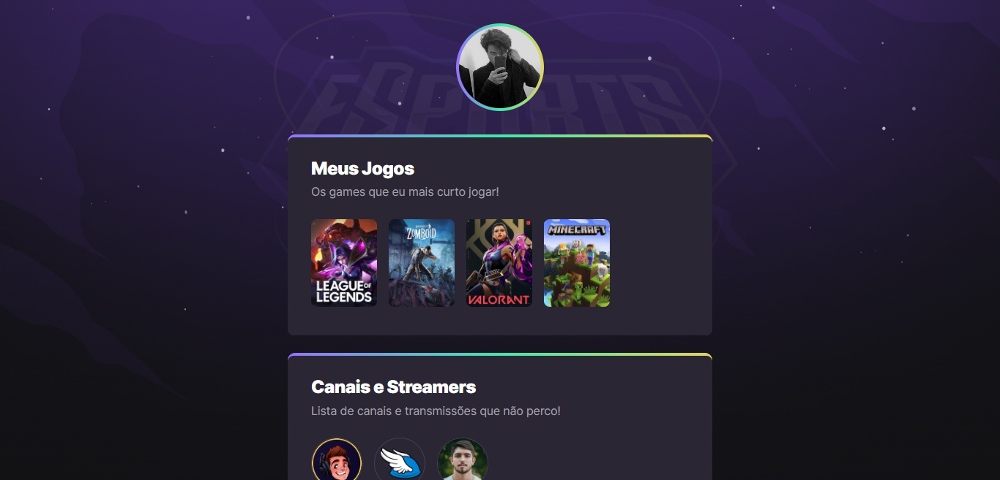

# NLW eSports

Projeto construído no evento Next Level Week.

 

## ☁️Deploy:

O [eSports](https://luisfelipets17.github.io/eSports/) está hospedado no GitHub Pages.

 

## 🎯 Objetivo:

Colocar em prática técnicas, conceitos e tecnologias utilizadas no desenvolvimento de páginas web.

 

## 💻 Tecnologias:

- HTML
- CSS
- Git e GitHub

 

## 📷 Tela inicial:

 

## 📂 Como rodar o projeto:

 

Passo 1. Clone este repositório pelo seu terminal:

 

> git clone github.com/LuisFelipeTS17/eSports.git

Passo 2. Acesse a pasta do projeto:

> cd eSports

Passo 3. Abra o projeto no seu editor de código favorito.
